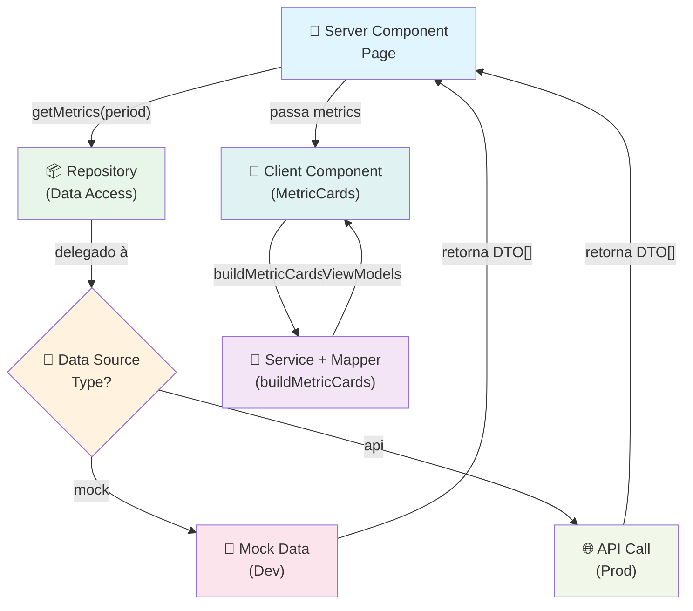
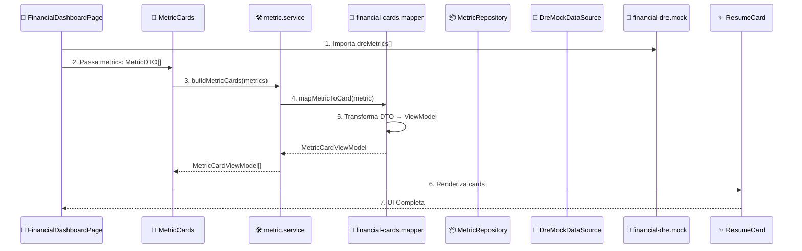
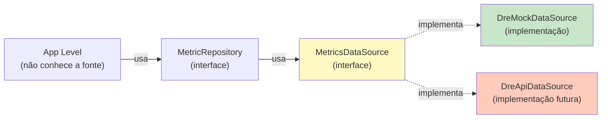
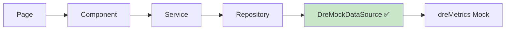
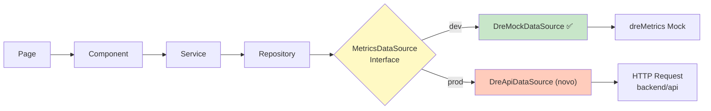
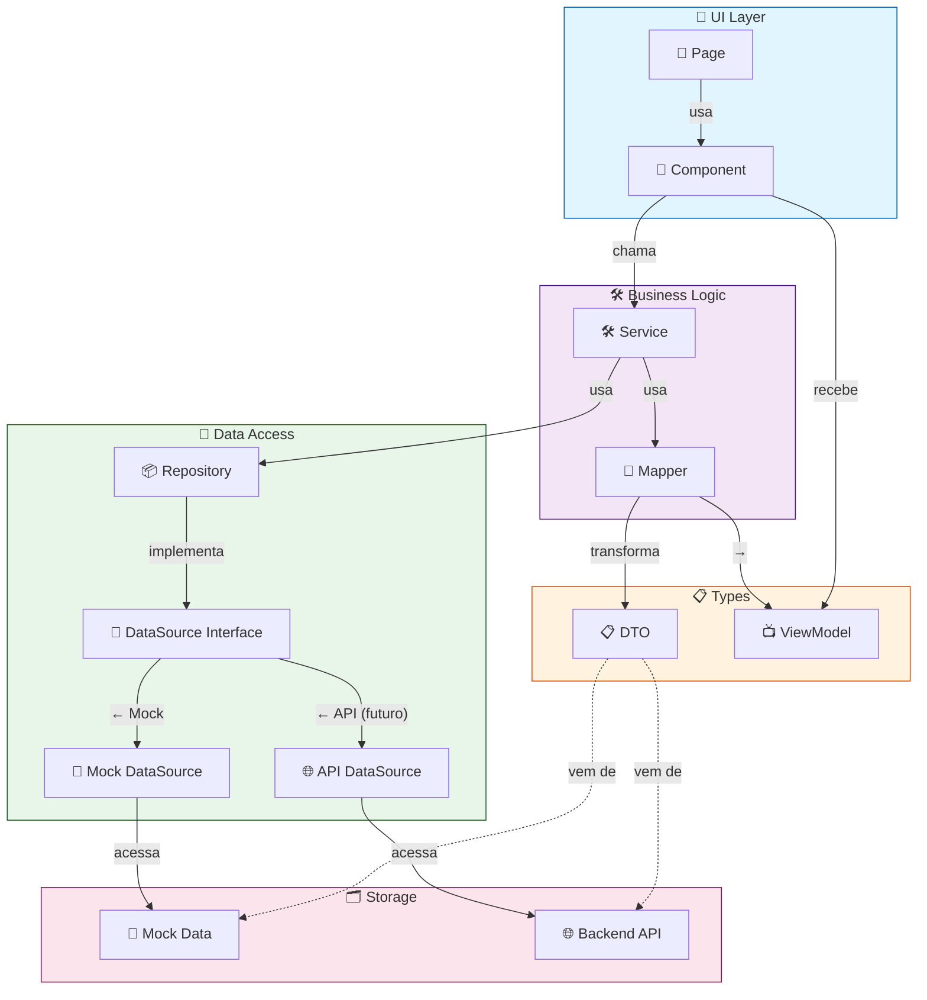

# 🏗️ Arquitetura do Projeto 4PS - Frontend

## 📑 Índice
- [Visão Geral](#visão-geral)
- [Fluxo de Dados](#fluxo-de-dados)
- [Estrutura de Camadas](#estrutura-de-camadas)
- [Componentes e Responsabilidades](#componentes-e-responsabilidades)
- [Exemplo Prático: DRE Dashboard](#exemplo-prático-dre-dashboard)
- [Transição de Mocks para API](#transição-de-mocks-para-api)
- [Guia de Implementação](#guia-de-implementação)
- [Boas Práticas](#boas-práticas)

---

## 🎯 Visão Geral

O projeto 4PS utiliza uma **arquitetura em camadas** que promove separação de responsabilidades, facilitando testes, manutenção e futura integração com APIs externas. A arquitetura segue o padrão **Repository Pattern** com **Data Sources abstratas** (Mock ou API).

### Camadas Principais:
```
┌─────────────────────────────────────────────────────┐
│                                                       │
│  📄 Pages/Components (UI Layer)                     │
│  ├─ pages/*.tsx                                      │
│  └─ src/components/**/*.tsx                          │
│                                                       │
├─────────────────────────────────────────────────────┤
│                                                       │
│  🎨 Services Layer (Business Logic)                 │
│  └─ src/services/**/*.ts                             │
│     ├─ Transformations (DTOs → ViewModels)          │
│     └─ Business rules & calculations                │
│                                                       │
├─────────────────────────────────────────────────────┤
│                                                       │
│  📦 Repository Layer (Data Abstraction)             │
│  └─ src/repository/**/*.ts                           │
│     └─ Interface desacoplada de data sources        │
│                                                       │
├─────────────────────────────────────────────────────┤
│                                                       │
│  🔌 Data Source Layer (Data Fetching)               │
│  ├─ src/sources/financial/*.ts (Mock)                │
│  └─ src/sources/financial/*.ts (API - Future)        │
│     ├─ DreMockDataSource                             │
│     ├─ DreApiDataSource (próximo)                    │
│     └─ Implementam MetricsDataSource interface       │
│                                                       │
├─────────────────────────────────────────────────────┤
│                                                       │
│  💾 Data Layer (Static Data)                         │
│  └─ src/mocks/**/*.mock.ts                           │
│     └─ Data fixtures para mocks                      │
│                                                       │
├─────────────────────────────────────────────────────┤
│                                                       │
│  📋 Types & Models                                   │
│  ├─ src/types/**/*.type.ts (ViewModels)              │
│  ├─ src/types/dtos/**/*.dto.ts (DTOs)                │
│  └─ src/mappers/**/*.mapper.ts (Transformations)    │
│                                                       │
└─────────────────────────────────────────────────────┘
```

---

## 🔄 Fluxo de Dados

> **Nota:** as pages no `app/` são executadas no servidor. Em vez de enviar classes ou funções para componentes de cliente, a página deve **buscar dados via repositório** e repassar **somente valores primitivos ou objetos puros** (DTOs/arrays). Isso evita o erro de `Serializing class instances` e mantém a separação entre server/client.

### Fluxo Geral de Requisição



### Fluxo Detalhado - Exemplo: Dashboard Financeiro



---

## 🏛️ Estrutura de Camadas

### 1️⃣ **UI Layer** - `app/` e `src/components/`

Responsável por renderizar a interface e capturar interações do usuário.

**Arquivos:**
- `app/protected/financial/dashboard/page.tsx` - Página do dashboard
- `src/components/metric-cards.tsx` - Componente que renderiza cards
- `src/components/resume-card/` - Componentes de apresentação

**Responsabilidades:**
- ✅ Renderizar interface
- ✅ Disparar eventos de usuário
- ✅ Exibir dados transformados
- ❌ Buscar ou transformar dados (responsabilidade da camada abaixo)

**Exemplo:**
```typescript
// app/protected/financial/dashboard/page.tsx
export default function FinancialDashboardPage() {
  return (
    <>
      <MetricCards metrics={dashboardMetrics} />
    </>
  );
}
```

---

### 2️⃣ **Service Layer** - `src/services/`

Contém lógica de negócio e transformações de dados.

**Arquivos:**
- `src/services/metric.service.ts` - Orquestra transformações de métricas
- `src/services/company.service.ts` - Lógica de negócio de empresas

**Responsabilidades:**
- ✅ Transformar DTOs em ViewModels
- ✅ Aplicar regras de negócio
- ✅ Orquestrar dados de múltiplos repositórios
- ✅ Formatação e cálculos
- ❌ Buscar dados brutos (responsabilidade do Repository)

**Exemplo:**
```typescript
// src/services/metric.service.ts
export function buildMetricCards(metrics: MetricDTO[]) {
  return metrics.map(mapMetricToCard);
  // Aqui também poderíamos:
  // - Aplicar filters
  // - Fazer cálculos
  // - Validações de negócio
}
```

---

### 3️⃣ **Repository Layer** - `src/repository/`

Abstração sobre fontes de dados (implementa o Repository Pattern).

**Arquivos:**
- `src/repository/metric.repository.ts` - Define interface de acesso a métricas
- `src/repository/financial/dre.repository.ts` - Factory para instanciar repository

**Responsabilidades:**
- ✅ Abstrair a origem dos dados
- ✅ Injetar o tipo de DataSource (Mock ou API)
- ✅ Desacoplar a aplicação de uma fonte específica
- ❌ Buscar dados diretamente (delegado à DataSource)

**Exemplo:**
```typescript
// src/repository/metric.repository.ts
export class MetricRepository {
  constructor(private datasource: MetricsDataSource) {}

  getMetrics() {
    return this.datasource.getMetrics();
  }
}

// src/repository/financial/dre.repository.ts
// Injeta a datasource
export const metricRepository = new MetricRepository(
  new DreMockDataSource()  // ← Será substituído futuramente
);
```

**Diagrama - Repository Pattern:**


---

### 4️⃣ **Data Source Layer** - `src/sources/`

Implementa a busca real de dados. Pode ser Mock ou API.

#### **Mock Data Source** (Desenvolvimento)

**Arquivos:**
```
src/sources/financial/
  ├─ dre/
  │  └─ dre-mock.data-source.ts        ← Implementação Mock
  └─ metrics.data-source.ts             ← Interface
```

**Exemplo:**
```typescript
// src/sources/financial/dre/dre-mock.data-source.ts
export class DreMockDataSource implements MetricsDataSource {
  async getMetrics() {
    // Simula latência de rede
    return dreMetrics;  // Dados mockados
  }
}
```

#### **API Data Source** (Futuro)

Será criado em paralelo ao Mock, implementando a mesma interface:

```typescript
// src/sources/financial/dre/dre-api.data-source.ts (futuro)
export class DreApiDataSource implements MetricsDataSource {
  constructor(private apiClient: HttpClient) {}

  async getMetrics(): Promise<MetricDTO[]> {
    return this.apiClient.get('/api/financial/dre/metrics');
  }
}
```

---

### 5️⃣ **Mock Data Layer** - `src/mocks/`

Dados estáticos usados para testes e desenvolvimento.

**Arquivos:**
- `src/mocks/financial-dre.mock.ts` - Dados mockados para DRE
- `src/mocks/financial-dashboard.mock.ts` - Dashboard completo

**Responsabilidades:**
- ✅ Fornecer dados de exemplo
- ✅ Validações de tipos (TypeScript)
- ⚠️ Usar para testes unitários

**Exemplo:**
```typescript
// src/mocks/financial-dre.mock.ts
export const dreMetrics: MetricDTO[] = [
  {
    title: "Receita Líquida",
    value: 493000,
    valueUnit: "currency",
    comparison: 12.5,
    comparisonUnit: "percentage",
    trend: 840000,
    trendUnit: "currency",
    goalProgress: 99,
  },
  // ... mais métricas
];
```

---

### 6️⃣ **Types & DTO Layer** - `src/types/`

Definições de tipos TypeScript para transferência e view.

**Tipos DTO (Data Transfer Object):**
```typescript
// src/types/dtos/metric.dto.ts
export type MetricDTO = {
  title: string;
  value: number;
  valueUnit: MetricUnit;
  comparison?: number;
  comparisonUnit?: "percentage" | "pp";
  trend?: number;
  trendUnit?: MetricUnit;
  goalProgress?: number;
};
```

**Tipos ViewModel (Para Apresentação):**
```typescript
// src/types/metric-card-view-model.type.ts
export type MetricCardViewModel = {
  title: string;
  icon: React.ElementType;
  mainValue: string;
  comparison?: number;
  comparisonUnit?: "percentage" | "pp";
  trendingValue?: string;
  goalProgress?: number;
};
```

**Mapeador (Transformação):**
```typescript
// src/mappers/financial-cards.mapper.ts
export function mapMetricToCard(metric: MetricDTO): MetricCardViewModel {
  return {
    title: metric.title,
    icon: iconMap[metric.title] || DollarSign,
    mainValue: formatMetricValue(metric.value, metric.valueUnit),
    comparison: metric.comparison,
    comparisonUnit: metric.comparisonUnit,
    trendingValue: formatMetricValue(metric.trend, metric.trendUnit),
    goalProgress: metric.goalProgress,
  };
}
```

---

## 💡 Exemplo Prático: DRE Dashboard

Vamos acompanhar o fluxo completo de uma requisição:

### **Passo 1: Page Component**
```typescript
// app/protected/financial/dre/page.tsx
import { MetricCards } from "@/src/components/metric-cards";
import { dreMetrics } from "@/src/mocks/financial-dre.mock";

export default function FinancialDREPage() {
  return <MetricCards metrics={dreMetrics} />;
}
```

### **Passo 2: Component recebe DTOs**
```typescript
// src/components/metric-cards.tsx
type MetricCardsProps = {
  metrics: MetricDTO[];  // ← DTOs do mock/API
};

export function MetricCards({ metrics }: MetricCardsProps) {
  const cards = buildMetricCards(metrics);  // ← Transforma em ViewModels
  
  return (
    <div className="grid grid-cols-4">
      {cards.map(card => (
        <ResumeCard key={card.title}>
          <ResumeCard.Title
            title={card.title}
            icon={card.icon}
          />
          <ResumeCard.MainValue value={card.mainValue} />
        </ResumeCard>
      ))}
    </div>
  );
}
```

### **Passo 3: Service transforma dados**
```typescript
// src/services/metric.service.ts
import { mapMetricToCard } from "@/src/mappers/financial-cards.mapper";

export function buildMetricCards(metrics: MetricDTO[]) {
  // Transforma DTO → ViewModel
  return metrics.map(mapMetricToCard);
  
  // Aqui você poderia também:
  // - Filtrar metrics
  // - Ordenar por prioridade
  // - Aplicar cálculos
  // - Validações
}
```

### **Passo 4: Mapeador converte tipo**
```typescript
// src/mappers/financial-cards.mapper.ts
export function mapMetricToCard(metric: MetricDTO): MetricCardViewModel {
  return {
    title: metric.title,
    icon: iconMap[metric.title],
    mainValue: formatMetricValue(metric.value, metric.valueUnit),
    comparison: metric.comparison,
    trendingValue: formatMetricValue(metric.trend, metric.trendUnit),
    goalProgress: metric.goalProgress,
  };
}
```

### **Passo 5: UI renderiza ViewModel**
```typescript
// src/components/resume-card/index.tsx
export function ResumeCard({ icon: Icon, title, mainValue }: MetricCardViewModel) {
  return (
    <div className="card">
      <Icon className="text-2xl" />
      <h3>{title}</h3>
      <p className="value">{mainValue}</p>
    </div>
  );
}
```

---

## 🔄 Transição de Mocks para API

### Atual (Mocks)



### Futuro (API + Mocks)



---

## 🛠️ Guia de Implementação

### Como Adicionar uma Nova Feature (com Dados Mockados)

#### **1. Criar o DTO**
```typescript
// src/types/dtos/report.dto.ts
export type ReportDTO = {
  id: string;
  title: string;
  content: string;
  createdAt: Date;
  status: "draft" | "published";
};
```

#### **2. Criar o ViewModel**
```typescript
// src/types/report-view-model.type.ts
export type ReportViewModel = {
  id: string;
  title: string;
  displayDate: string;
  statusBadge: "Rascunho" | "Publicado";
};
```

#### **3. Criar o Mapeador**
```typescript
// src/mappers/report.mapper.ts
export function mapReportToViewModel(dto: ReportDTO): ReportViewModel {
  return {
    id: dto.id,
    title: dto.title,
    displayDate: formatDate(dto.createdAt),
    statusBadge: dto.status === "draft" ? "Rascunho" : "Publicado",
  };
}
```

#### **4. Criar os Mocks**
```typescript
// src/mocks/reports.mock.ts
export const reportsMock: ReportDTO[] = [
  {
    id: "1",
    title: "Relatório de Vendas",
    content: "...",
    createdAt: new Date("2025-02-20"),
    status: "published",
  },
  // ... mais dados
];
```

#### **5. Criar a Interface DataSource**
```typescript
// src/sources/reports.data-source.ts
import { ReportDTO } from "@/src/types/dtos/report.dto";

export interface ReportsDataSource {
  getReports(): Promise<ReportDTO[]>;
  getReportById(id: string): Promise<ReportDTO>;
}
```

#### **6. Criar a Mock DataSource**
```typescript
// src/sources/reports/reports-mock.data-source.ts
export class ReportsMockDataSource implements ReportsDataSource {
  async getReports(): Promise<ReportDTO[]> {
    return reportsMock;
  }

  async getReportById(id: string): Promise<ReportDTO> {
    return reportsMock.find(r => r.id === id)!;
  }
}
```

#### **7. Criar o Repository**
```typescript
// src/repository/reports.repository.ts
export class ReportsRepository {
  constructor(private datasource: ReportsDataSource) {}

  getReports() {
    return this.datasource.getReports();
  }

  getReportById(id: string) {
    return this.datasource.getReportById(id);
  }
}

// src/repository/reports/reports.repository.ts (factory)
export const reportsRepository = new ReportsRepository(
  new ReportsMockDataSource()
);
```

#### **8. Criar a Camada de Serviços**
```typescript
// src/services/reports.service.ts
import { mapReportToViewModel } from "@/src/mappers/report.mapper";

export function buildReportsViewModels(dtos: ReportDTO[]) {
  return dtos.map(mapReportToViewModel);
}
```

#### **9. Criar o Componente**
```typescript
// src/components/reports-list.tsx
type ReportsListProps = {
  reports: ReportDTO[];
};

export function ReportsList({ reports }: ReportsListProps) {
  const viewModels = buildReportsViewModels(reports);

  return (
    <div className="space-y-4">
      {viewModels.map(report => (
        <ReportCard key={report.id} {...report} />
      ))}
    </div>
  );
}
```

#### **10. Usar na Page**
```typescript
// app/protected/reports/page.tsx
import { ReportsList } from "@/src/components/reports-list";
import { reportsMock } from "@/src/mocks/reports.mock";

export default function ReportsPage() {
  return <ReportsList reports={reportsMock} />;
}
```

---

### Transição de Mocks para API

Quando estiver pronto para conectar à API, **nenhuma outra camada precisa mudar**:

#### **Passo 1: Criar a API DataSource**
```typescript
// src/sources/reports/reports-api.data-source.ts
import { HttpClient } from "@/src/lib/client";
import { ReportDTO } from "@/src/types/dtos/report.dto";

export class ReportsApiDataSource implements ReportsDataSource {
  constructor(private http: HttpClient) {}

  async getReports(): Promise<ReportDTO[]> {
    return this.http.get<ReportDTO[]>("/api/reports");
  }

  async getReportById(id: string): Promise<ReportDTO> {
    return this.http.get<ReportDTO>(`/api/reports/${id}`);
  }
}
```

#### **Passo 2: Trocar apenas o Repository**
```typescript
// src/repository/reports/reports.repository.ts
// Trocar APENAS esta linha:
- export const reportsRepository = new ReportsRepository(
-   new ReportsMockDataSource()
- );

+ export const reportsRepository = new ReportsRepository(
+   new ReportsApiDataSource(httpClient)
+ );

// Todos os outros arquivos continuam IDÊNTICOS!
```

**Vantagens:**
- ✅ Zero alterações em componentes
- ✅ Zero alterações em services
- ✅ Zero alterações em páginas
- ✅ Fácil voltar para mocks se necessário
- ✅ Testes unitários não mudam

---

## 📖 Boas Práticas

### ✅ DO's

- ✅ **Manter camadas bem separadas** - Cada camada tem uma responsabilidade clara
- ✅ **Usar interfaces** - `MetricsDataSource` permite múltiplas implementações
- ✅ **Tipo-segurança** - DTOs e ViewModels evitam bugs
- ✅ **Mocks para desenvolvimento** - Velocidade de desenvolvimento sem dependências externas
- ✅ **Mapeadores explícitos** - Transformação clara de dados
- ✅ **Repository como ponte** - Desacopla a aplicação da fonte de dados

### ❌ DON'Ts

- ❌ **Componentes buscando dados diretamente** - Quebra abstração
  ```typescript
  // ❌ RUIM
  const data = fetch('/api/metrics').then(r => r.json());
  ```

- ❌ **Lógica de transformação em componentes** - Deve estar em Services
  ```typescript
  // ❌ RUIM
  {metrics.map(m => ({
    title: m.title,
    value: formatCurrency(m.value),
    // ... lógica de mapeamento
  }))}
  ```

- ❌ **Dados da API diretamente em componentes** - Sem Mapeamento
  ```typescript
  // ❌ RUIM
  fetch('/api/metrics').then(data => setMetrics(data));
  // Componente fica acoplado à estrutura da API
  ```

- ❌ **Diferentes DataSources sem interface** - Quebra o contrato
  ```typescript
  // ❌ RUIM
  // Mock e API com métodos diferentes
  ```

### 📋 Checklist para Nova Feature

- [ ] Criar DTO (`src/types/dtos/`)
- [ ] Criar ViewModel (`src/types/`)
- [ ] Criar Mapeador (`src/mappers/`)
- [ ] Criar Mocks (`src/mocks/`)
- [ ] Criar Interface DataSource (`src/sources/`)
- [ ] Criar Mock DataSource (`src/sources/**/`)
- [ ] Criar Repository (`src/repository/`)
- [ ] Criar Service (`src/services/`)
- [ ] Criar Component (`src/components/`)
- [ ] Usar em Page (`app/`)
- [ ] Testar com Mocks
- [ ] Documentar no README

---

## 🔑 Diagrama Resumido



---

## 📚 Referências de Arquivos

### Arquitetura Atual

```
frontend/
├── app/
│   └── protected/
│       └── financial/
│           ├── dashboard/
│           │   └── page.tsx          ← Entry point
│           └── dre/
│               └── page.tsx          ← Entry point
│
├── src/
│   ├── components/
│   │   ├── metric-cards.tsx          ← Componente principal
│   │   ├── metric-card/
│   │   └── resume-card/              ← Componente de apresentação
│   │
│   ├── services/
│   │   ├── metric.service.ts         ← Lógica de transformação
│   │   └── company.service.ts
│   │
│   ├── repository/
│   │   ├── metric.repository.ts      ← Interface Repository
│   │   └── financial/
│   │       └── dre.repository.ts     ← Factory + Injeção
│   │
│   ├── sources/
│   │   ├── financial/
│   │   │   ├── metrics.data-source.ts        ← Interface
│   │   │   └── dre/
│   │   │       └── dre-mock.data-source.ts  ← Implementação Mock
│   │   └── company/
│   │
│   ├── mocks/
│   │   ├── financial-dre.mock.ts    ← Dados para DRE
│   │   └── financial-dashboard.mock.ts
│   │
│   ├── types/
│   │   ├── metric-card-view-model.type.ts   ← ViewModel
│   │   ├── metric-unit.type.ts
│   │   └── dtos/
│   │       └── metric.dto.ts         ← DTO
│   │
│   ├── mappers/
│   │   └── financial-cards.mapper.ts ← Transformação
│   │
│   ├── lib/
│   │   ├── client.ts                 ← HTTP Client
│   │   └── server.ts
│   │
│   └── util/
│       └── format-currency.ts        ← Utilities
│
└── ARCHITECTURE.md                   ← Este arquivo!
```

---

## 🚀 Próximos Passos

1. **Implementar API DataSource** para módulo de Empresas
2. **Criar testes unitários** validando mappers
3. **Adicionar tratamento de erros** em DataSources
4. **Implementar cache** em Repository
5. **Adicionar validações** em Services

---

**Versão:** 1.0  
**Última atualização:** Fevereiro 2025  
**Mantido por:** Time 4PS Frontend
